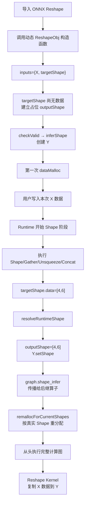

<!--more-->
写一个做项目时的笔记，记录一下

# ONNX
这是一个需要调用的python包，它的作用是把 PyTorch、TensorFlow 等框架训练出来的模型，转换成一个统一的计算图格式 .onnx，然后交给不同推理后端运行。

一个ONNX模型大概可以理解为：
```
ModelProto
│
└── GraphProto
    │
    ├── inputs
    │
    ├── outputs
    │
    ├── initializer
    │     └── 模型参数
    │
    └── nodes
          ├── MatMul
          ├── Add
          ├── Relu
          └── ...
```
```
```

```txt 
ModelProto
│
├── ir_version          int
├── opset_import        repeated OperatorSetIdProto
│
└── graph               GraphProto
     │
     ├── node            repeated NodeProto
     ├── initializer     repeated TensorProto
     ├── input           repeated ValueInfoProto
     ├── output          repeated ValueInfoProto
     └── value_info      repeated ValueInfoProto
                              │
                              └── type       TypeProto
                                   │
                                   └── tensor_type
                                        │
                                        ├── elem_type   int(enum)
                                        └── shape       TensorShapeProto
                                              │
                                              └── dim
                                                   └── Dimension
                                                       ├── dim_value: int
                                                       └── dim_param: str
```
这个加上了数据类型

在构建模型时会接触到很多名字后面带Proto的数据结构的东西，例如：TensorProto, 它们是由 Protocol Buffers（protobuf）定义的数据结构。ONNX 模型本质上就是一组 protobuf 对象，最后序列化成 .onnx 二进制文件。

首先是ModelProto，它是.onnx文件最外层的数据结构

GraphProto是模型中的计算图，`graph = model.graph`，包含下面的信息：
```txt 
graph.input        模型输入信息
graph.output       模型输出信息
graph.value_info   中间 Tensor 的类型和 Shape 信息
graph.initializer  权重、常量
graph.node         算子节点
```

ValueInfoProto: Tensor的描述信息，例如：
```python 
x = helper.make_tensor_value_info(
    "x",
    TensorProto.FLOAT,
    ["batch", 2],
)
```

得到的是：
```
ValueInfoProto
├── name = "x"
└── type
    └── tensor_type
        ├── elem_type = FLOAT
        └── shape = ["batch", 2]
```

TensorProto:
```
ValueInfoProto：描述 Tensor 是什么
TensorProto：通常保存 Tensor 的实际常量数据
```
它是带数据的Tensor， 例如：
```
weight = helper.make_tensor(
    name="weight",
    data_type=TensorProto.FLOAT,
    dims=[2, 3],
    vals=[1, 2, 3, 4, 5, 6],
)
```
可以理解为：
```
TensorProto
├── name = "weight"
├── data_type = FLOAT
├── dims = [2, 3]
└── data = [1, 2, 3, 4, 5, 6]
```

ONNX的数据类型：
```
TensorProto.FLOAT    # 1
TensorProto.UINT8    # 2
TensorProto.INT8     # 3
TensorProto.INT16    # 5
TensorProto.INT32    # 6
TensorProto.INT64    # 7
TensorProto.BOOL     # 9
TensorProto.FLOAT16  # 10
TensorProto.DOUBLE   # 11
```

TensorShapeProto:
ValueInfoProto 里面包含：value_info.type.tensor_type.shape,这个 shape 的类型就是：TensorShapeProto

例如shape = x.type.tensor_type.shape，核心字段是：shape.dim，它是一个维度列表：
```
for dim in shape.dim:
    print(dim)
```
对于：
```
["batch", 2, unknown, "width"]
```
会得到：
```
dim { dim_param_param: "batch" }
dim { dim_value_value: 2 }
dim {}
dim { dim_param: "width" }
```

NodeProto:一个算子节点：
```
node = helper.make_node(
    "MatMul",
    ["x", "weight"],
    ["y"],
    name="matmul",
)
```
->:
```
NodeProto
├── op_type = "MatMul"
├── input = ["x", "weight"]
├── output = ["y"]
├── name = "matmul"
└── attribute = []
```

AttributeProto：算子属性

OperatorSetIdProto：ONNX opset 版本


# Task1 
> **1. 完善 ONNX 动态维度的导入和表示，正确处理固定维度与动态维度；**

为什么这里动态维度处理不对？
在onnx.py中会调用:
```python 
def _take_shape_dim(shape):
    return [
        d.dim_value if d.dim_value > 0 else 1
        for d in shape.dim
    ]
```
这意味着：
```
ONNX 声明：["batch", 2]
转换结果：[1, 2]
```
所以转换以后"batch"被丢掉了.

整个数据流我拿AI跑了一下，长这样：
```
模型导入阶段
────────────────────────────────────────

ONNX X: ["batch", 2]
        ↓ onnx.py
初始具体 Shape: [1, 2]
        ↓ GraphHandler
TensorObj X
        ↓ MatMul inferShape
TensorObj Y: [1, 3]
        ↓ dataMalloc
分配 X/W/Y 内存
        ↓
复制 initializer W


运行阶段
────────────────────────────────────────

用户 set_input([4, 2])
        ↓
X.setShape([4, 2])
        ↓
Graph.shape_infer()
        ↓
Y.setShape([4, 3])
        ↓
Graph.dataMalloc()
        ↓
更新 X/Y 内存
        ↓
用户 copyin X 的真实数值
        ↓
Runtime.run()
        ↓
MatMul Kernel
        ↓
输出 Y: [4, 3]
```
```

## 理解下面的代码
```python 
model = copy.deepcopy(model)

original_initializer_names = {
    initializer.name for initializer in model.graph.initializer
}

original_input_shape_specs = {
    input_info.name: _parse_shape_spec(input_info.type.tensor_type.shape)
    for input_info in model.graph.input
    if input_info.name not in original_initializer_names
}

has_dynamic_input = any(
    _shape_spec_is_dynamic(shape_spec)
    for shape_spec in original_input_shape_specs.values()
)

# Keep dynamic input and Shape semantics unchanged. Static models retain the
# existing simplification path.
if not has_dynamic_input:
    try:
        # onnx simplifier performs inplace simplify
        model_simp, check = simplify(copy.deepcopy(model))
        if check:
            model = model_simp
    except ValidationError:
        pass
    except RuntimeError:
        pass

```

首先先复制一份ONNX模型，然后找出真正的模型输入，解析它们的shape约束，最后判断模型是否存在动态输入维度

initializer是什么： 通常是模型中的固定参数，例如:weight, bias, embedding table, constant tensor. 

# Task2 
支持项目所需的基础 Shape Tensor 相关算子；

下面是例子：

```txt 
X: ["batch", 2, 3]
│
├─ Shape(X)
│    S.shape = [3]
│    S.data  = [batch, 2, 3]
│
├─ Gather(S, index=0)
│    G.shape = []
│    G.data  = batch
│
├─ Unsqueeze(G, axes=[0])
│    U.shape = [1]
│    U.data  = [batch]
│
├─ Constant([6])
│
├─ Concat(U, [6])
│    RS.shape = [2]
│    RS.data  = [batch, 6]
│
└─ Reshape(X, RS)
     Y.shape = [batch, 6]
```

首先得意识到一个问题：Tensor 的 Shape 元数据，和 Shape Tensor，是完全不同的东西。

为什么这个重要，是因为Tensor已经是有实际的内容了，而Shape实际上只是对Tensor的描述。而Shape本身也有自己的shape，

一个Operator是什么：
```txt 
OperatorObj
│
├── type
│   └── 我是什么算子
│       Shape / Gather / Reshape / Add ...
│
├── inputs
│   └── 输入 Tensor
│
├── outputs
│   └── 输出 Tensor
│
├── predecessors
│   └── 哪些算子在我前面
│
└── successors
    └── 哪些算子在我后面

OperatorObj
    │
    ├── inputs ────────→ Tensor ──→ metadata
    │                             ├─ shape
    │                             ├─ dtype
    │                             └─ Blob data
    │
    └── outputs ───────→ Tensor
```
注意Operator实际是没有data的，因为Operator本身不保存实际Tensor的数据。

这里有个很重要的函数是InferShape()

为什么它重要，是因为他是一个纯虚函数，相当于这里要求每一个算子都必须会根据输入推导自己输出的Shape，而具体怎么算由子类决定。

先实现算子吧：
Shape：
先综述一下整个流程：

```txt 
构图阶段
ShapeObj::inferShape()
    输出 Tensor Shape = [input rank]

ShapeObj::inferDataType()
    输出 Tensor dtype = Int64

内存分配阶段
Graph::dataMalloc()
    为输出分配 rank × 8 bytes

运行阶段
CpuRuntimeObj::run()
    根据 CPU + Shape 找到 ShapeCpu
        ↓
ShapeCpu::compute()
    读取输入 Shape 元数据
        ↓
    写入输出 Tensor 数据
```


因为C++我还不太熟悉，所以这里陈述一下语法相关的点：

```c++
ShapeObj::ShapeObj(
    GraphObj *graph,
    Tensor input,
    Tensor output
)
    : OperatorObj(
          OpType::Shape,
          {input},
          {output}
      ) {
    IT_ASSERT(checkValid(graph));
}
```
`ShapeObj::ShapeObj(..._)`是ShapeObj的构造函数

`: OperatorObj(...)`是调用父类的构造函数

为什么两边都要写参数，这是因为两边需要的参数并不同

namespace: 封装空间 

在做gather算子的操作的时候，注意到CheckIndexValid似乎在operator阶段访问了Tensor Blob，这里有内存泄露的风险，这里考虑到把它删掉，后面再做处理。

这里我阐述一下gather是在做什么：根据 indices 给出的下标，从输入 Tensor 的指定维度 axis 上取出元素或数据块，并按 indices 的形状组织输出。

ONNX Gather的输出Shape规则是：
```txt 
data.shape[:axis]
+ indices.shape
+ data.shape[axis + 1:]
```
这里有点绕，逻辑是axis那一维不重要了，因为我的indices是在那一维去取它。

这里kernel里面复制数据代码长这样，逻辑有点绕 ：
```c++
// ONNX Gather 允许负 index。
                IT_ASSERT(index >= -axisDim && index < axisDim,
                          "Gather index is out of range");
                if (index < 0)
                    index += axisDim;

                const size_t inputElementOffset =
                    (outerIndex * static_cast<size_t>(axisDim) +
                     static_cast<size_t>(index)) *
                    inner;
                const size_t outputElementOffset =
                    (outerIndex * indexCount + indexOffset) * inner;

                std::memcpy(result + outputElementOffset * elementBytes,
                            input + inputElementOffset * elementBytes,
                            copyBytes);

# Task3
```
支持由运行时 Shape Tensor 驱动的 Reshape 等动态 Shape 算子；

这里的思路逻辑是，Reshape依赖前后的一个输出值

原本的运行方式是：
```txt 
构图
  ↓
inferShape()
  ↓
dataMalloc()
  ↓
依次执行所有 Kernel
```

静态构图我们确实能够很好的运行，因为Reshape已经拿到了具体的值，但是动态构图不太行，因为它需要前面保存的数据，前面的数据决定了它的shape，以至于它不能第一时间分配内存。


所以这边把逻辑改成如下：
```txt 
使用占位 Shape 完成初次内存分配
          ↓
只执行 Shape/Gather/Unsqueeze/Concat 等 Shape 子图
          ↓
读取 Reshape 的 shapeTensor.data
          ↓
更新 Reshape 输出及后继 Tensor 的 Shape
          ↓
重新规划整张图的内存
          ↓
从头执行完整计算图
```


这里我们定义了一个新的函数resolveRuntimeShape，它的作用是：
```txt 
读取 shapeTensor.data
    ↓
按照 ONNX Reshape 规则解析
    ↓
得到本次真正的输出 Shape
    ↓
更新 ReshapeObj::outputShape
    ↓
更新输出 Tensor 的 Shape 元数据
```





