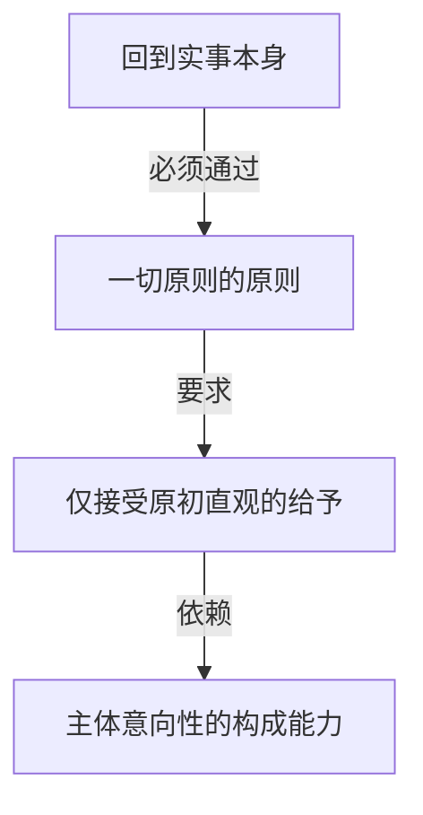

暑假速通一下现象学，本身我也读过马里翁的《情爱现象学》，正好借此机会更深入的了解一下现象学的相关理论。
不打算记录的那么详细，会将GPT生成的文字和自身看过后想写的一些东西记录下来。

<!--more-->

# 第一章 突破与扩展
## 两种解释与一项拓展

### Q：

怎么理解：“即使是为了展开存在意义的问题，存在也必须被给予，以便能够追问其意义。胡塞尔的壮举恰恰在于吧存在置于在场之上，使存在以现象的方式呈现于范畴之中。由于这一壮举，我最终有了一个低级：‘存在’不是一个单纯的概念，不是一个通过演绎活动而得到的纯粹抽象”

A:
**核心句子的分层解读**
#### 1. **“即使是为了展开存在意义的问题，存在也必须被给予”**  
   - **关键点**：任何对“存在”的哲学追问（比如海德格尔的“存在之问”），都**必须以存在的显现为前提**。  
   - **马里翁的立场**：现象（包括“存在”本身）必须首先**被给予我们**，才能成为被思考的对象。  
   - **类比**：就像你必须先收到一份礼物（给予），才能去研究它是什么（追问意义）。  

#### 2. **“胡塞尔的壮举在于把存在置于在场之上”**  
   - **“在场”**（presence）指现象**直接向意识显现**的状态。  
   - **胡塞尔的突破**：传统形而上学（如康德）认为“存在”不可知，只能通过概念推理；但胡塞尔通过**现象学还原**，让存在本身作为一种**现象**直接呈现于意识（即“在场”）。  
   - **意义**：存在不再是抽象概念，而是可被直观的“事物本身”。

#### 3. **“使存在以现象的方式呈现于范畴之中”**  
   - **“范畴”**：指意识的基本结构（如时间、空间、因果性等）。  
   - 胡塞尔认为，现象必须在意识的范畴框架内才能被理解（例如：一个苹果作为现象，需通过“颜色”“形状”等范畴被把握）。  
   - **马里翁的潜在批评**：胡塞尔仍将现象束缚于**主体的认知结构**中（范畴即主体的牢笼）。

#### 4. **“存在不是一个单纯的概念……不是纯粹抽象”**  
   - 胡塞尔的贡献在于**将存在从形而上学抽象拉回具体经验**：  
     - 传统哲学：存在 = 逻辑推导出的概念（如“上帝存在”）。  
     - 胡塞尔：存在 = 可被直观的现象（如“我眼前这张桌子的存在感”）。  

### Q: 海德格尔的此在是怎样的一种概念

A:
海德格尔的“**此在**”（Dasein，德语直译为“在那里存在”）是他哲学的核心概念，特指**人的存在方式**。它既不是传统哲学中的“主体”，也不是生物学意义上的“人”，而是揭示“存在意义”的关键通道。理解这一概念需要跳出传统框架，下面从五个维度展开：

---

#### **一、此在的本质：不是“什么”，而是“如何”**
-为什么此在特殊 **传统哲学**：将人定义为“理性动物”（亚里士多德）或“思维主体”（笛卡尔）。  
- **海德格尔的颠覆**：  
  **此在的本质在于它的“生存”（Existenz）**——它不是现成的“实物”，而是一种**动态的“去存在”（to be）的可能性**。  
  > 例：一把锤子是“现成在手”（固定功能），而此在是“上手状态”（不断在行动中定义自己）。

---

#### **二、此在的独特性：对“存在”发问的存在者**
- **为什么此在特殊？**  
  只有此在会追问：“**存在**（Being）**本身意味着什么？**”  
  - 石头不会思考自己的存在，  
  - 但此在的生存天然包含对自身存在的**领会**（understanding）。  
  > 此在是存在得以显现的“澄明之地”。

---

#### **三、此在的生存结构：“在世界之中存在”**
此在**绝非孤立主体**，而是始终嵌在三个互相交织的结构中（称“**在世结构**”）：  
1. **世界**（World）：  
   - 不是物理宇宙，而是**意义网络**（如锤子的意义指向“敲钉子”，进而指向“盖房子”……）。  
   - 此在通过使用工具（“上手状态”）揭示世界的意义。  
2. **常人**（Das Man, “the They”）：  
   - 此在的日常状态被**社会规范**支配（“别人都这么做”），导致个体失去本真性。  
   - 例：按社交媒体标准生活，逃避自我选择。  
3. **自身**（Self）：  
   - 此在可能沉沦于“常人”，也可能通过**畏**（Angst）直面死亡，回归**本真存在**。  


---

#### **四、此在的时间性：面向死亡的“操心”**
此在的生存本质是“**操心**”（Sorge, Care），其根基是**时间性**：  
- **过去**（被抛性）：此在被抛入特定历史、文化中（非自愿）。  
- **现在**（沉沦）：日常陷入闲谈、好奇、两可的“常人”状态。  
- **未来**（筹划）：通过“**向死而生**”获得本真性——  
  **死亡**作为最私己的可能性，迫使此在直面自身有限性，从而**主动筹划人生**。  
> 例：意识到生命有限，放弃跟风，选择自己真正热爱的职业。

---

#### **五、此在与马里翁的分歧关键**
| **维度**       | **海德格尔**                  | **马里翁**                     |
|----------------|-------------------------------|-------------------------------|
| **核心关注**   | 存在意义（通过此在追问）       | **现象如何自我给予**           |
| **此在角色**   | 存在意义的揭示者              | **可能遮蔽给予性**            |
| “存在”的根基   | 此在的生存论结构              | **现象自身的给予性**（先于此在）|

- **马里翁的批评**：  
  海德格尔让“此在”垄断了存在意义的解释权（如“工具的意义由此在赋予”），这仍是**隐蔽的主体中心主义**。  
- **马里翁的主张**：  
  现象（如艺术品、神圣启示）可能**超越此在的领会框架**，以饱和状态“给予”自身意义，甚至颠覆此在的预期。


### Q:

怎么理解：“《逻辑研究》的突破在于把处于其先天观念性中的含义解放出来”这句话

A:
胡塞尔在《逻辑研究》（特别是第一研究“表达与含义”）中提出的这一主张，彻底颠覆了19世纪流行的**心理主义**逻辑观，是现象学诞生的关键突破。要理解这句话，需要分三步解开其历史背景、核心概念和哲学革命性：

---

#### **一、背景：胡塞尔对抗的敌人——心理主义**
- **心理主义是什么？**  
  19世纪主流观点（如约翰·穆勒、西格瓦特）认为：  
  - **逻辑规律是心理活动的产物**（例如“A=A”源于人脑的联想习惯）。  
  - **含义（meaning）是主观心理图像**（想到“狗”时你脑海中的狗形象）。  
- **致命问题**：  
  如果逻辑依赖于个人心理，那么**真理将失去普遍性**（你的“狗”和我的“狗”可能不同），数学和科学的基础将崩溃。

---

#### **二、胡塞尔的突破：含义的“先天观念性”**
#### 1. **“含义”不是心理图像，而是观念对象**  
   - 例：当你说“三角形有三条边”：  
     - **心理主义**：含义=你脑海中具体的三角形图像（如▲）。  
     - **胡塞尔**：含义= **“三角形”的理想概念本身**（不受具体图像影响）。  
   - **关键区分**：  
     - **心理行为**（你的思考活动，主观且多变）  
     - **含义内容**（“三角形定义”，**客观且恒定**）  

#### 2. **“先天观念性”的涵义**  
   | 术语        | 解释                                                                 |
   |-------------|----------------------------------------------------------------------|
   | **先天**    | 独立于经验（不依赖具体感知或心理过程）                               |
   | **观念性**  | 属于**理念领域**（非物理实体，也非心理状态），具有普遍性和必然性     |  
   > 例：数学真理“1+1=2”是先天观念的——即使宇宙毁灭，它仍然成立。

#### 3. **如何“解放”含义？**  
   胡塞尔将含义从**心理学的束缚**中解放出来：  
   - 含义不再是私人的、模糊的心理图像；  
   - 而是**公共的、精确的观念对象**，可被不同主体**同一地把握**（你我理解的“三角形”本质相同）。  

---


#### **三、哲学革命：为现象学奠基**
#### 1. **确立现象学领域**  
   含义作为观念对象，成为现象学研究的**自主领域**：  
   - 无需还原为心理过程，也无需依赖物理世界。  
   - 现象学任务：**直观**（intuition）含义的本质（如“什么是正义？”）。  

#### 2. **“范畴直观”的可能性**  
   胡塞尔发现，我们不仅能直观具体事物（如看苹果），还能**直接把握抽象观念**（如“红色本身”“存在本身”），这为哲学提供了严格方法。  

#### 3. **影响链**  
   ```mermaid
   graph LR
   A[反心理主义] --> B[含义作为观念对象] --> C[现象学还原] --> D[回到事物本身]
   ```

---

#### **马里翁视角的深意**
马里翁在《还原与给予》中重提这一突破，是为了铺垫自己的主张：  
1. 胡塞尔解放了含义，但**仍将含义绑定于主体意向性**（含义需被意识“构成”）。  
2. 马里翁要进一步解放现象：  
   - **现象自身**（如神圣启示、艺术震撼）**能超越主体意向性主动给予意义**。  
   > 胡塞尔释放了含义，马里翁想释放现象本身！

---

#### **生活化类比：理解“三角形”的三种方式**
| **理论**       | **如何理解“三角形”**                     | **问题**                     |
|----------------|------------------------------------------|------------------------------|
| 心理主义       | “我脑中▲的图像”                          | 你的▲和我的△不同，数学崩溃   |
| 胡塞尔         | **“三角形”的理想定义**（三条边，内角和180°） | 客观真理得以成立             |
| 马里翁（延伸） | 三角形以**溢出定义的方式震撼你**（如分形艺术中无限复杂的三角结构） | 现象反抗主体的概念框架       |

---

#### **为什么这一突破如此重要？**
- **拯救了逻辑与数学的客观性**：使20世纪分析哲学、语言哲学成为可能。  
- **现象学奠基**：为“回到事物本身”提供方法论，影响海德格尔、梅洛-庞蒂等。  
- **马里翁的跳板**：若含义可独立于心理，现象为何不能独立于主体？  

> 胡塞尔解放了含义，马里翁则试图用**给予性**解放现象本身——这是《还原与给予》的核心战役。

### Q:
什么是“一切原则的原则”

A:
胡塞尔的“**一切原则的原则**”（the principle of all principles）是现象学的**方法论基石**，出自《纯粹现象学和现象学哲学的观念》（1913）。它定义了现象学如何“回到事物本身”，并直接影响了马里翁对“给予性”的思考。以下是分层解析：

---

#### **一、原则的原文与核心主张**
> **“任何原初给予的直观都是知识的合法源泉，在直观中原初地（可说是在其机体的现实中）给予我们的东西，应按其被给予的限度被接受。”**  
> （《观念I》§24）

#### 关键点浓缩：
1. **直观优先**：知识的终极基础是**直观**（直接体验），而非逻辑推理或理论假设。  
2. **原初给予性**：现象必须在**亲身被给予**的限度内被承认。  
3. **反建构主义**：禁止用先验概念篡改现象的自我显现。  

> 💡 简单说：**现象怎么显现场，就怎么接受它！**

---

#### **二、为什么这是“一切原则的原则”？**
它颠覆了传统哲学的认知等级：
| **传统哲学**         | **胡塞尔的现象学**        |
|----------------------|--------------------------|
| 理性推理 > 感官经验  | **直观经验 > 理性建构**  |
| 理论优先于现象       | **现象优先于理论**        |  
| 主体强加范畴于对象   | **让对象自身显现**        |

- **地位**：它是现象学还原的**终极依据**，其他方法（如悬置判断）皆服务于它。

---

#### **三、“直观”的深意：不仅是感官，更是范畴直观**
胡塞尔的“直观”包含两类：  
1. **感性直观**（Sensory Intuition）：  
   - 感知具体事物（如看见红色、触摸冰块）。  
2. **范畴直观**（Categorical Intuition）⭐：  
   - **直接把握抽象本质**（如“红本身”“正义”“存在”）。  
   > 例：当你理解“5+7=12”，你不是在数手指，而是直观到数学真理本身。

- **突破性**：传统哲学认为抽象概念需通过推理获得，胡塞尔宣称我们能**直接“看见”本质**。

---


#### **四、马里翁的继承与批判**
马里翁在《还原与给予》中，以此原则为跳板推进现象学革命：  

| **维度**       | **胡塞尔**                  | **马里翁的推进**              |
|----------------|----------------------------|------------------------------|
| **给予者**     | 主体意向性构成现象         | **现象自身给予**（自我显现）  |
| **直观界限**   | 受限于主体认知结构         | **饱和现象突破主体框架**     |
| “原则”的缺陷   | 隐含主体中心性             | 解放现象的绝对给予性         |

- **继承**：完全接受“直观作为源泉”。  
- **批判**：胡塞尔仍要求现象**符合主体的直观能力**（如时间/空间形式），而饱和现象（如神迹、艺术）**溢出直观能力**，迫使主体被动接受。  
  > 马里翁：若现象以不可控的方式给予，主体必须“投降”而非“构成”。

---

#### **五、生活化类比**
想象你第一次看到极光：  
- **传统哲学家**：  
  用物理学解释（电子碰撞大气层），忽略眼前的震撼。  
- **胡塞尔**：  
  **暂停科学理论**，专注描述极光**如何直接呈现**于你的视觉（色彩流动、空间感）。  
- **马里翁**：  
  极光以**超越你认知的壮美**（饱和现象）击溃你，你只能惊叹——“它给予的远比我能接受的更多”。

---

#### **六、该原则的哲学史意义**
| Column1. **反形而上学**：拒绝用抽象概念（如“实体”“上帝”）覆盖真实经验。  
2. **反科学主义**：科学模型需回溯到直观经验，而非替代经验。  
3. **为现象学奠基**：所有现象学研究必须始于“直观到的被给予者”。  

> 马里翁的使命：若现象自身是给予的源泉，那么现象学还原的终点应是**现象的绝对给予性**，而非主体的意向性。这正是《还原与给予》的书名深意。


### 我们要在充分发挥了的直观中获得明见性：
这个在现时抽象中被给予之物与语词含义在规律表述中所指之物是真实而现实的同一体。

### Q:
我不太理解先天观念性，这个概念不需要论证吗，还是说这是个前提条件，为什么就能得出我直观的就是事物本身的含义

A:
你的质疑非常犀利！这正点中了现象学最关键的难题：**胡塞尔如何能断言“先天观念性”的存在？它是否只是一个未被论证的前提？** 让我们解剖这个问题的复杂性，从现象学的内在逻辑和潜在争议入手：

---

#### **一、“先天观念性”的论证逻辑：现象学描述而非传统证明**
胡塞尔的方法不是数学式的“演绎论证”，而是通过**现象学描述**让你“**看见**”观念性的存在。其步骤可概括为：
1. **揭露心理主义的荒谬**：  
   如果含义是主观心理图像 → 则逻辑/数学失去客观性 → 科学知识崩溃（归谬法）。  
   > 例：若“1+1=2”取决于你的脑细胞状态，数学将无法普遍有效。

2. **引导你“直观”观念对象**：  
   - **操作**：请你反思“三角形”的含义：  
     - 你脑海中的▲（心理图像）总是模糊的、可变的（如角度不精确），  
     - 但你理解的“三角形本质”（三条边、内角和180°）是**精确、永恒不变**的。  
   - **结论**：这个不变的“本质”就是**先天观念对象**——它独立于你的心理活动。

3. **本质直观（Wesensschau）的合法性**：  
   胡塞尔认为，通过**悬置经验判断**（现象学还原），你能直接“看”到观念本质，如同用眼睛看颜色。  
   > 这不是推理，而是**认知方式的转换**——就像从平面视角切换到3D视角后，你突然理解了空间关系。

---

#### **二、为什么敢说“直观到事物本身”？——现象学还原的保障**
胡塞尔通过两步操作，试图确保直观的客观性：
| **步骤**             | **功能**                                                                 |
|----------------------|--------------------------------------------------------------------------|
| **悬置判断**（Epoche） | 搁置对“三角形是否存在”的信念，专注其**显现方式**（避免经验干扰）。       |
| **本质还原**          | 从具体三角形（▲/△）中“抽象”出普遍本质，但非逻辑抽象，而是**直观本质**。 |

- **关键主张**：  
  还原后，意识中呈现的**就是事物本身**（现象），而非心理表征或物理对象。  
  > 例：还原后你关注的不是纸上画的▲，而是“三角形性”（triangularity）本身。

---

#### **三、潜在争议：循环论证？**
批评者（如自然主义者）指出：  
- 现象学预设了“直观能把握本质”，但这正是待证明的！  
- 所谓“观念对象”可能只是**大脑的认知错觉**（神经活动模式）。

#### 胡塞尔的回应：
1. **先验转向**：  
   不讨论“观念对象是否实存”，而探究“它如何必然被我们经验”。  
   > 类似康德：不问“上帝是否存在”，而问“为何人类必有上帝观念”。

2. **自明性（Evidenz）标准**：  
   当一种直观达到**明见性**（无可置疑的清晰性），它就是真理的源泉。  
   > 例：你无法怀疑“思维中的怀疑行为本身存在”（笛卡尔式自明）。

---

#### **四、马里翁的推进：从“直观”到“给予”**
马里翁在《还原与给予》中揭示胡塞尔的深层矛盾：
- **胡塞尔的理想**：让现象自身显现（一切原则的原则）。  
- **实际执行**：现象必须**符合主体的直观能力**（如时间/空间形式），否则无法被接纳。  

#### 马里翁的解决方案：
1. **倒转关系**：  
   不是主体“直观”现象，而是现象“给予”自身。  
2. **饱和现象的颠覆性**：  
   某些现象（如神迹、无限的爱）**溢出主体的直观能力**，迫使主体承认：  
   - 直观有其界限，  
   - **现象自身才是意义的绝对源泉**。  
   > 此时，“先天观念性”被“绝对给予性”取代——观念不是被主体“看见”的，而是现象主动“撞击”主体。

---

#### **五、生活化类比：理解“三角形”的两种进路**
#### **场景**：你和朋友争论“什么是完美三角形”
- **自然主义者**：  
  “完美三角形不存在！你看到的只是近似▲的物理图形或神经元放电。”  
- **胡塞尔主义者**：  
  “闭上眼，悬置对纸笔的信念，专注‘三角形’的意义——你是否‘看到’一个超越一切具体图像的、精确的几何本质？”  
- **马里翁主义者**：  
  “当你突然被分形几何中的曼德博集合震撼时（无限复杂的三角结构），是数学现象自身在向你显现其深渊般的给予性，而非你在‘把握’它。”

---

#### 结论：现象学的“冒险”
胡塞尔对“先天观念性”的坚持，本质是**一场哲学赌注**：  
1. **赌直观的可靠性**：人能通过训练直接把握本质。  
2. **赌现象学描述的严格性**：还原后的体验是普遍的、可交流的。  
3. **赌反心理主义的必要性**：若放弃观念客观性，理性将崩塌。  

> 马里翁则赌得更激进：**现象给予的暴力性能冲破主体性的牢笼**，这恰是《还原与给予》的革命性所在。


### Q:

什么是回到实事本身，与原则的原则有什么区别

A:
“**回到实事本身**”（Zu den Sachen selbst!）是胡塞尔现象学的**总纲领**，而“**一切原则的原则**”是实现这一纲领的**具体方法论准则**。二者是目标与手段的关系，但隐含深刻张力。让我们通过对比解析它们的联系与区别：

---

#### **一、核心定义与关系**
| **概念**               | **定位**         | **功能**                                                                 |
|------------------------|------------------|--------------------------------------------------------------------------|
| **回到实事本身**       | **现象学目标**   | 哲学的根本任务：摆脱偏见，**直接面向现象**（而非理论建构）。             |
| **一切原则的原则**     | **第一方法论**   | 实现上述目标的**操作标准**：以直观到的“原初给予”为唯一合法知识来源。    |

> 简言之：  
> - **“回到实事”是目的地**（“去罗马！”），  
> - **“原则的原则”是交通工具使用手册**（“必须坐火车去，禁止绕路！”）。

---

#### **二、如何理解“回到实事本身”？**
#### 1. **针对谁的革命？**  
   - 反对**传统形而上学**：用抽象概念（如“实体”“上帝”）覆盖真实经验。  
   - 反对**科学主义**：用数学公式替代生活世界（如用“波长”定义红色，忽略红玫瑰的绚烂）。  

#### 2. **“实事”（Sachen）指什么？**  
   不是物理对象，而是**意识中显现的现象**，包括：  
   - 感官对象（苹果的颜色）  
   - 抽象观念（正义、数字）  
   - 情感体验（爱的感受）  
   > 💡 关键：现象必须**如其显现自身的样子**被考察，而非被理论扭曲。

#### 3. **如何“回到”？**  
   通过 **现象学还原**（悬置自然态度），剥离附加在现象上的预设：  
   | **自然态度**          | **现象学态度**              |
   |-----------------------|----------------------------|
   | 相信苹果独立于意识存在 | 关注“苹果”**如何向意识显现** |
   | 用生物学解释爱情      | 描述爱**被体验的方式**       |

---

#### **三、“一切原则的原则”的特殊性——它给“回到实事”套上枷锁**
胡塞尔为“回到实事”设置了**不可违反的操作规则**：  

#### **枷锁体现**：
1. **直观的垄断性**：  
   现象必须被**主体直观到**才能合法——若现象超出直观能力（如“无限”），则被排除。  
   > 例：神启若无法被感官或范畴直观，则不被承认为“实事”。  
   
2. **主体中心的隐性预设**：  
   现象需符合主体的认知结构（时间/空间形式），否则无法“被给予”。  
   - **马里翁的批评**：这实则是**主体对现象的暴力驯化**，违背了“回到实事”的初心。

---

#### **四、关键区别：目标 vs. 手段的断裂**
| **维度**         | **回到实事本身**                | **一切原则的原则**                  |
|------------------|--------------------------------|-------------------------------------|
| **开放性**       | 理想上**向所有现象敞开**        | **以直观为门槛**，过滤“非常态”现象  |
| **主客体关系**   | 现象优先（消弭主客对立）        | 隐含**主体对现象的审查权**          |
| **马里翁的批判** | 应彻底忠于现象自身给予性        | 实际沦为**主体中心主义的工具**      |

> **悖论**：胡塞尔的口号呼吁“回到现象”，但他的方法却要求“现象回到主体框架内”。

---

#### **五、案例：如何分析“一次宗教启示”**
-你不是在数手指 **胡塞尔的操作**：  
  1. 悬置对“神是否存在”的判断（现象学还原）。  
  2. 尝试**直观**该体验——若启示内容（如“无限者”）**无法被主体直观**（超出时空范畴），则判定其无效。  
  → 结论：这不是合法“实事”。  

- **马里翁的主张**（《还原与给予》）：  
  1. 宗教启示作为 **“饱和现象”**，恰恰以**溢出直观能力的方式给予自身**。  
  2. 真正的“回到实事本身”要求**放弃直观原则**，接受现象自身的绝对给予性。  
  → 结论：启示是更高阶的“实事”，它暴露了胡塞尔原则的局限。  

---

#### **六、哲学史意义：马里翁的颠覆**
马里翁认为：  
- **真正的“回到实事本身”** 必须忠于现象**自我显现的绝对自由**，哪怕颠覆主体框架。  
- **胡塞尔的矛盾**：  
  他的目标（回到实事）是革命的，  
  他的手段（原则的原则）却是保守的——将现象囚禁在“主体牢笼”中。  
  > **解决路径**：用 **“给予性”** 替代 **“直观性”** 作为最高原则——现象学应从“主体构成”转向“现象给予”。

---

#### **结语：从口号到战场**
- **胡塞尔**：  
  “回到实事”的口号 + “直观原则”的方法 → 现象学作为**严格科学**。  
- **马里翁**：  
  解放“回到实事”的原始承诺 → 现象学作为 **“给予性”的启示录**。  

> 二者的张力正是《还原与给予》的核心动力：若现象自身是源泉，那么连“直观”都可能是对现象的遮蔽——真正的还原，是还原到**无条件的给予**。

### Q:
什么是存在论

A:
**存在论（Ontology）** 是哲学的核心分支，探究 **“存在本身”（Being as such）** 而非具体存在者的终极问题。它追问：
- **什么使事物“存在”而非“不存在”？**  
- **“存在”本身意味着什么？**  
- **不同存在者（如物质、意识、数字）的存在方式有何根本差异？**  

以下从 **概念内涵、历史演进、现象学转向** 三方面解析，并关联马里翁《还原与给予》的批判性突破——

---

#### 一、**存在论的核心问题**  
#### 1. **存在 vs. 存在者**（海德格尔的“存在论差异”）  
| 概念          | 解释                                                                 | 例子                                          |  
|---------------|----------------------------------------------------------------------|-----------------------------------------------|  
| **存在者**（beings） | 具体存在的实体（人、石头、数字、情感）                              | 这把椅子、牛顿定律、你此刻的喜悦              |  
| **存在**（Being）   | 使存在者得以存在的 **根本条件** 或 **显现方式**（非实体）            | 椅子的“物性”、定律的“真理性”、喜悦的“情绪性”  |  
> **关键**：存在论不研究“椅子是什么”，而研究 **“椅子为何能作为‘物’存在”**。  

#### 2. **经典问题域**  
- 存在是 **一还是多**？  
- 存在是 **物质还是精神**？  
- 存在具有 **层级结构** 吗？（如柏拉图：理念 > 现象）  
- **虚无是否存在**？  

---

#### 二、**存在论的历史演进**  
#### 1. **古希腊奠基**  
- **巴门尼德**：存在是“ **一** ”（永恒不变），非存在不可言说。  
- **亚里士多德**：提出 **“第一哲学”**（即存在论），定义存在为 **“实体”**（ousia），并通过 **范畴**（如质、量、关系）分析存在方式。  

#### 2. **中世纪神学转向**  
- 存在 = **上帝创造**（阿奎那：存在分等级，上帝是“纯粹存在”）。  

#### 3. **近代认识论挤压**  
- 笛卡尔 → 康德：存在论问题被 **认识论**（人如何认识存在？）取代。  
  > 康德：存在 **不是谓词**（说“上帝存在”未增加新内容），只能通过主体范畴认知。  

#### 4. **现象学重启存在论**  
| 哲学家       | 突破                                                         |  
|--------------|--------------------------------------------------------------|  
| **胡塞尔**   | 搁置“存在是否客观”问题，专注 **现象如何在意识中显现**（意向性）。 |  
| **海德格尔** | ⭐ **存在论革命**：追问 **“存在本身的意义”**，揭示“此在”（人）是理解存在的通道。 |  

---

#### 三、**海德格尔的存在论革命 → 马里翁的批判**  
#### 1. **海德格尔的核心主张**  
- **此在（Dasein）优先性**：  
  只有人（此在）会追问存在意义，故存在论需通过 **此在的生存分析**（如“在世”“向死而生”）展开。  
- **存在被时间性定义**：  
  存在不是现成实体，而是 **动态的“去存在”**（becoming），其意义在时间中生成。  

#### 2. **马里翁在《还原与给予》中的爆破**  
马里翁认为海德格尔仍陷于 **隐蔽的主体中心主义**：  
- **问题**：  
  海德格尔让 **此在垄断存在意义的解释权**（存在需通过此在的生存结构显现）。  
- **解决方案**：  
  用 **“给予性”（givenness）取代“存在”** 作为第一哲学范畴：  
  - 现象（如神迹、艺术品）可 **主动自我给予**，溢出此在的理解框架（饱和现象）。  
  - **存在本身也需被给予**！ → 存在不是起点，而是 **给予的结果**。  
  > “存在者必须首先 **被给予**，才能追问其存在” —— 这才是现象学最彻底的还原。  

---

#### 四、**生活化类比：存在论的三种视角**  
#### **场景**：面对一座雪山  
| 视角         | 存在论问题                          | 回应                                   |  
|--------------|-------------------------------------|----------------------------------------|  
| **传统哲学** | 雪山是 **什么实体**？               | “由岩石、冰雪构成的物质实体”           |  
| **海德格尔** | 雪山如何向 **此在显现存在意义**？   | “在攀登的畏与美中，揭示自然的在场性”   |  
| **马里翁**   | 雪山如何 **自我给予** 其存在？      | “雪山的壮美 **强行侵入** 我的感知，使我被动接受其超越性” |  

---

#### 五、**为什么马里翁要解构存在论？**  
在《还原与给予》中，他试图证明：  
1. **存在论的历史是遗忘“给予性”的历史**：  
   从古希腊到海德格尔，哲学总将存在 **预设为起点**，却忽略了存在者首先需 **被给予我们**。  
2. **现象学应回归更本源维度**：  
 
   饱和现象（如十字架上的牺牲、梵高的《星空》）证明：  
   - **给予先于存在**，  
   - **现象自身才是意义的绝对源泉**。  

> 存在论非被废除，而是被 **置于给予性之下** —— 这是马里翁对现象学的彻底激进化。

---


### Q:

怎么理解下面这段话：“如果这种对认识意义的思索所提供的不是一种单纯的意见，而是像这里所严格要求的那样，提供一种明晰的(einsichtig)知识，那么它就必须在被给予的思维体验和认识体验的典范性的基础上作为纯粹的本质直观来进行”

A:
这段出自胡塞尔《现象学的观念》的文本，浓缩了现象学作为**严格科学**的方法论核心——它要求哲学必须摆脱意见（doxa），通过**本质直观**（Wesensschau）获得**绝对明晰的知识**。以下分三步拆解其逻辑：

---

#### **一、句子结构解剖**
> “如果这种对认识意义的思索……”  
> - **目标**：获得 **“明晰的知识”**（非主观意见）  
> - **方法**：**纯粹的本质直观**  
> - **操作基础**：**被给予的思维体验和认识体验的典范性实例**  

---

#### **二、关键概念解析**
#### 1. **“明晰的知识”（einsichtig）**  
   - 不是逻辑推理的结论，而是 **直接自明的真理**（如同“2+2=4”般无可置疑）。  
   - 要求 **绝对清晰性**，排除任何模糊、推测或传统偏见。  
   > 💡 现象学的野心：哲学应像数学一样严密。

#### 2. **“被给予的思维体验和认识体验”**  
   - **思维体验**（Denkerlebnisse）：具体意识活动（如怀疑、判断、想象）。  
   - **认识体验**（Erkenntniserlebnisse）：指向真理的意识行为（如理解一个数学证明）。  
   - **关键**：这些体验必须是 **现象学还原后的纯粹现象**（悬置其是否对应外部实在），仅关注其 **内在被给予性**。  

#### 3. **“典范性的基础上”**  
   - 需选取 **典型实例** 作为分析对象（如分析“感知”时，选一个苹果的视觉体验）。  
   - 这些实例是 **本质直观的跳板**，类似几何学家用具体三角形把握“三角性”。  

#### 4. **“纯粹的本质直观”**（reine Wesensintuition）⭐  
   - **本质直观 ≠ 经验归纳**：  
     | 经验归纳               | 本质直观                     |  
     |------------------------|------------------------------|  
     | 从100个苹果观察红色 | 从一个苹果的红色 **直观“红本身”** |  
   - **操作步骤**：  
     1. **自由想象变更**：在想象中任意修改苹果的属性（大小、形状、位置）。  
     2. **发现不变项**：当所有属性变化时，“红”的**本质内核**依然恒定。  
     3. **把握本质**：这个不变项（如“视觉延展性”“色谱定位”）就是 **“红”的本质**。  

---

#### **三、深层逻辑：现象学如何成为“严格科学”？**
#### 1. **对抗两种错误路径**  
   | 错误类型       | 问题                     | 现象学方案               |  
   |----------------|--------------------------|--------------------------|  
   | **经验主义**   | 依赖感官，知识或然性     | 通过本质直观获得**必然性** |  
   | **理性主义**   | 脱离体验，陷入概念空转   | 以**被给予的体验**为地基 |  

#### 2. **本质直观的合法性保障**  
   - **自明性**（Evidenz）：当直观达到 **无可置疑的清晰度**（如你无法否认“正在思考”这一行为的存在），即为真理。  
   - **主体间可验证性**：不同主体对同一本质（如“红”）的直观结果一致（类似数学家对“圆”的理解相同）。  

#### 3. **马里翁的潜在批评**  
   胡塞尔假设本质直观 **依赖主体能力**（自由变更需主体执行），而马里翁主张：  
   - 某些现象（如神圣者的显现）**抗拒自由变更**（无法被任意想象修改），  
   - 其本质恰恰在 **突破主体框架** 时自我给予。  
   > 例：基督的复活事件不可“想象变更”，它以 **绝对饱和性** 给予自身本质。

---

#### **四、生活化示例：理解“愤怒”的本质**
#### **传统哲学**  
- 经验主义：统计100人发怒时的生理数据（心跳加速、脸红）→ 得出概率性结论。  
- 理性主义：用概念推演“愤怒是理性的丧失”。  

#### **胡塞尔现象学操作**  
1. **选取典范体验**：回忆一次真实愤怒（如被无故指责）。  
2. **自由想象变更**：  
   - 变更对象（老板/朋友）、场合（办公室/家中）、强度（暴怒/隐忍）...  
3. **发现不变本质**：  
   - 愤怒的 **核心** = **“对不公侵犯的抗拒感”**（即使对象和形式变化，此内核不变）。  
4. **获得明晰知识**：  
   - 这不是统计结论，而是 **直观到的愤怒本质本身**。  

---

#### **五、哲学史意义：现象学的科学奠基**
胡塞尔借此宣告：  
1. **哲学知识可能**：通过本质直观突破“意见”的泥潭。  
2. **操作严格性**：需扎根于被给予的体验，避免形而上学空谈。  
3. **对马里翁的启示**：  
   - 胡塞尔的 **“被给予性”** 是起点，  
   - 但马里翁将其推向极致：现象自我给予的 **暴力性** 可摧毁主体直观框架（如饱和现象）。  

> 这段文本是 **现象学方法论的浓缩宣言**——它要求哲学家像科学家观察实验般 **“直观”意识的本质结构**，而这正是《还原与给予》中马里翁既继承又爆破的基点。


### Q:

怎么理解：“胡塞尔宣布了：对原初的感性感念，即对直观和感知这两个概念的不可或缺的扩展，这种扩展使得我们有权探讨范畴直观，特别是有权谈论普遍直观”

A:
胡塞尔在《逻辑研究》中提出的 **“范畴直观”**（categorial intuition）概念，是对传统认识论的根本性革命。这句话宣告了现象学对“直观”能力的 **双重扩展**，彻底打破了经验主义对直观的狭隘限定。以下是逐层解析：

---

#### **一、背景：传统直观理论的枷锁**
#### 传统哲学（经验主义+康德）的教条：
1. **直观仅限感性**：  
   - 直观 = 感官直接接收的内容（颜色、声音、触感等）。  
2. **范畴仅属理性**：  
   - 抽象概念（如“存在”“统一性”“因果”）需通过 **知性范畴加工** 感性材料获得，**无法被直观**。  
   > 康德：范畴是主体的先天认知框架，现象需经其“塑形”才能被认识。

---

#### **二、胡塞尔的突破：直观概念的“双重扩展”**
胡塞尔的核心主张：  
> **直观不仅限于感性！我们还能直接“看见”范畴与普遍本质！**  

#### 扩展1：**从“感性直观”到“范畴直观”**  
| 概念            | 对象                  | 例子                                  |  
|-----------------|-----------------------|---------------------------------------|  
| **感性直观**    | 具体事物的属性        | 看见苹果的红色（感觉材料）            |  
| **范畴直观** ⭐ | **范畴关系与形式**    | 直接把握“苹果 **是** 红的”（“是”的关系） |  

- **关键案例**（《逻辑研究》VI）：  
  当你看见 **“一张白纸”**：  
  - 感性直观：白色、矩形、光滑感。  
  - **范畴直观**：  
    - “白”**与**“纸”的 **联结**（“白-纸”而非“白+纸”），  
    - 纸 **作为主体** 承载白色（**主谓结构**），  
    - 整张纸 **是** 白的（**存在判断**）。  
  > 💡 **革命性**：范畴形式（如“是”“与”“或”）**本身被给予**，而非主体强加！

#### 扩展2：**从“个别直观”到“普遍直观”**  
| 概念            | 对象                  | 例子                                  |  
|-----------------|-----------------------|---------------------------------------|  
| **个别直观**    | 单个事物              | 看见这只苹果                          |  
| **普遍直观** ⭐ | **本质或共相**        | 直观“苹果性”（所有苹果的普遍本质）    |  

- **操作方式**：**自由想象变更**（见前文分析）  
  > 例：通过想象不同苹果（青/红、大/小），发现不变内核——**“苹果性”**（多汁果肉、核心种子等）。

---

#### **三、为什么“不可或缺”？——现象学作为严格科学的根基**
胡塞尔扩展直观，是为了解决哲学的核心危机：
1. **拯救逻辑与数学的客观性**：  
   - 若“1+1=2”或“A=A”无法被直观，则它们只是主观约定。  
   - **范畴直观**使逻辑律（如矛盾律）成为 **自明的被给予者**。  
2. **为本质科学奠基**：  
   - 数学、几何学、伦理学的研究对象（数、正义、空间）需通过 **普遍直观** 把握其本质。  
3. **打破主客二元对立**：  
   - 范畴不再仅是“主观形式”，而是 **现象自身显现的关系结构**。  

> **马里翁在《还原与给予》中的继承**：  
> 胡塞尔证明直观可超越感性，为马里翁的 **“饱和现象”**（如神性显现）奠定基础——若范畴可被直观，更高阶的给予为何不能？

---

#### **四、生活化示例：理解“友谊”**
-  **经验主义**：  
  统计100对朋友的行为（吃饭、聊天频率）→ 归纳“友谊”特征（或然性结论）。  
- **胡塞尔现象学**：  
  1. **典范实例**：反思你与挚友的一次深谈。  
  2. **范畴直观**：把握“信任 **与** 理解”“他 **为** 你付出”等关系形式。  
  3. **普遍直观**：  
     - 想象变更朋友身份（同学/同事）、事件（借钱/陪伴）...  
     - 发现不变本质：**“互为主体性的精神共在”**。  
  → 获得对“友谊”的 **本质性明见**（必然知识）。

---

#### **五、哲学史意义：从康德到胡塞尔的哥白尼反转**
| **康德**                  | **胡塞尔**                     |  
|---------------------------|--------------------------------|  
| 范畴是主体加工感性的工具  | **范畴是现象自身显现的形式**   |  
| 普遍性来自主体先天能力    | **普遍性被直观在现象中**       |  
| 现象符合主体              | **主体忠于现象的自我给予**     |  

- **胡塞尔的宣言**：  
  **现象自身包含范畴结构！** 主体只需“看”，而非“构造”。  
  > 这为马里翁的 **“现象主权”**（现象主动给予意义）埋下伏笔。

---

#### **结语：直观的解放与现象学的彻底化**
胡塞尔对直观的扩展，使哲学真正可能 **“回到事物本身”**：  
1. **砸碎枷锁**：直观不再被感官禁锢，可通达关系与本质。  
2. **马里翁的激进推进**：  
   - 若直观能接纳范畴与普遍者，  
   - 为何不能接纳 **彻底超越主体框架的饱和现象**（如神的绝对他性）？  
   > 《还原与给予》的核心使命：将直观扩展进行到底，直至现象 **无条件自我给予** 的深渊。
h


